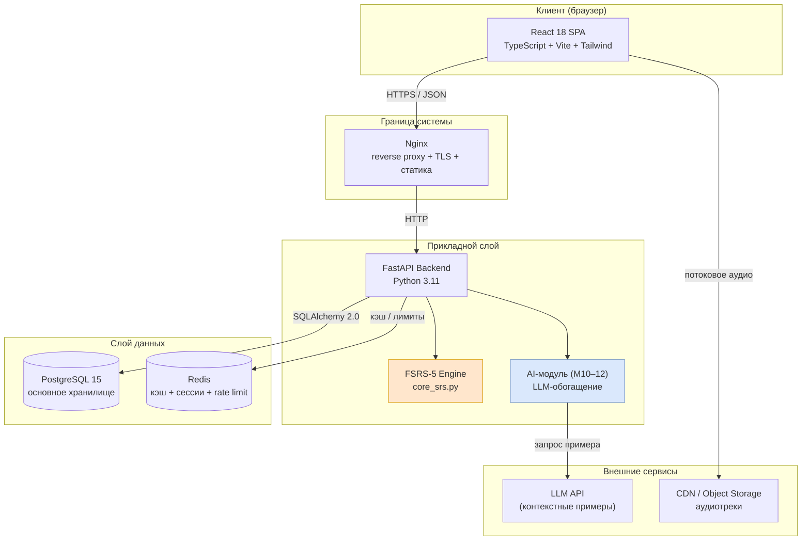
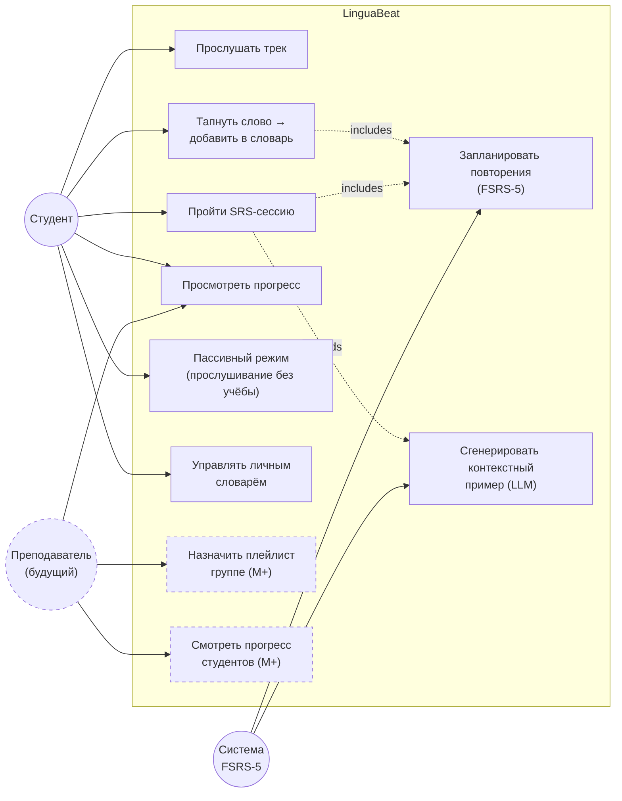
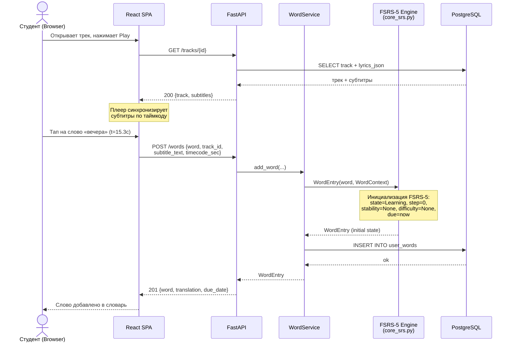
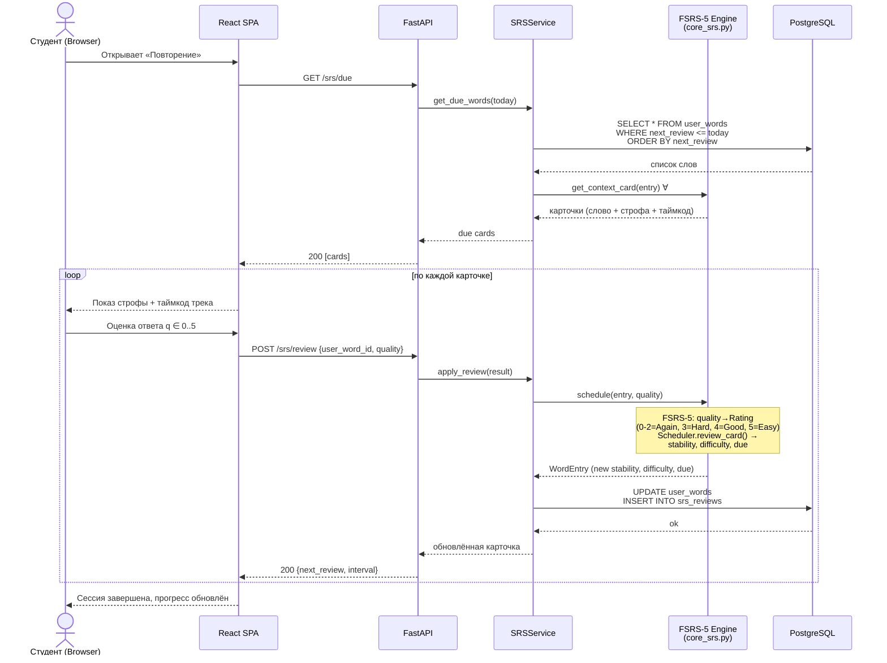
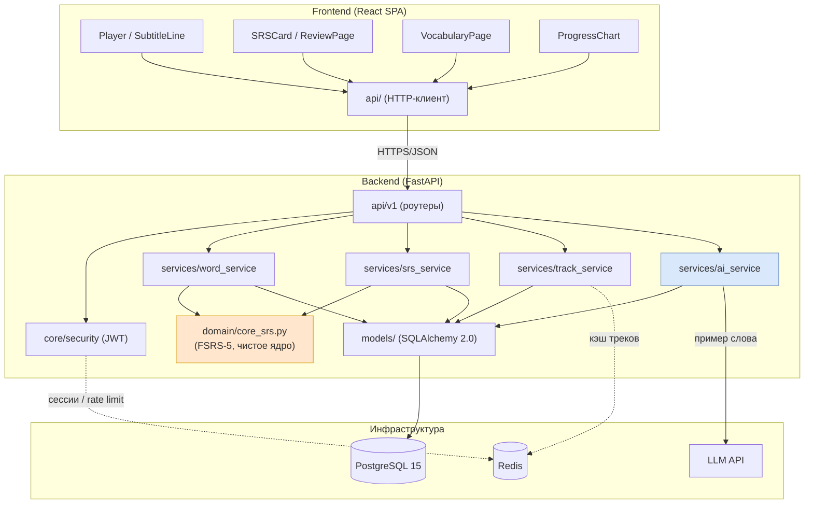
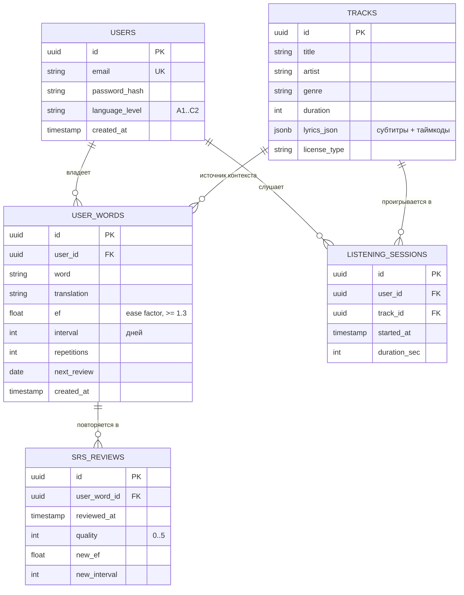
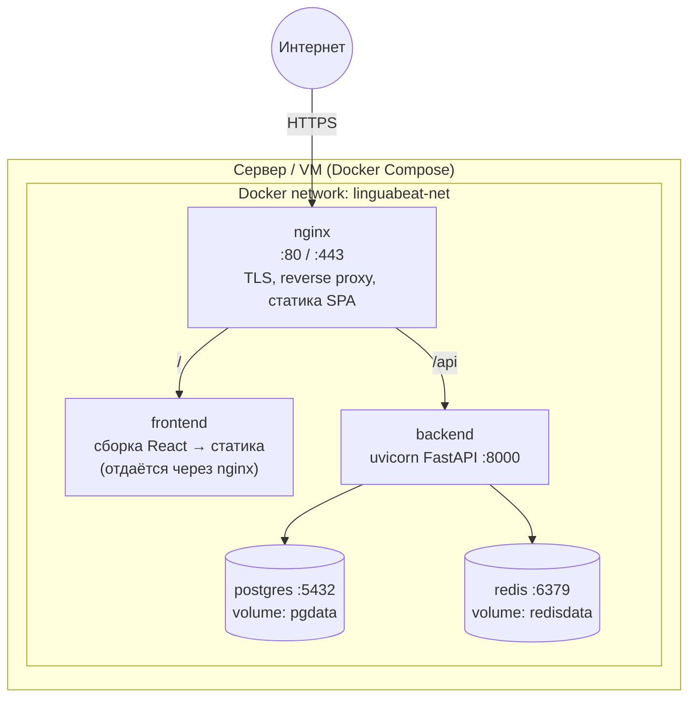

# Архитектура веб-платформы LinguaBeat

> Полная архитектурная документация веб-платформы для изучения русского языка как
> иностранного (РКИ) через музыку и алгоритм интервального повторения FSRS-5.
>
> **Версия документа:** 1.0
> **Дата:** 2026-06-06
> **Статус:** MVP-архитектура
> **Ядро SRS:** [`backend/app/domain/core_srs.py`](../backend/app/domain/core_srs.py)

---

## 1. Обзор архитектуры

### 1.1 Краткое описание системы

**LinguaBeat** — веб-платформа, обучающая русскому языку через прослушивание
лицензированных музыкальных треков с субтитрами в реальном времени. Ключевая
инновация: слово запоминается вместе со своим **музыкальным контекстом** —
треком, строфой и таймкодом, где оно встретилось. Повторение по алгоритму **FSRS-5**
происходит в том же фонетическом и эмоциональном контексте, что и первое знакомство.

**Первый рынок:** иностранные студенты российских вузов (РУДН, СПбГУ и др.).
**Бизнес-модель:** freemium, 250 руб./мес. за полный доступ.

Система построена как классическая трёхзвенная архитектура (клиент — API — данные)
с выделенным слоем доменной логики (SRS-движок) и вспомогательными сервисами
(кэш Redis, будущий AI-модуль на этапе М10–12).

### 1.2 Компонентная схема (высокий уровень)



---

## 2. Технологический стек с обоснованием

| Слой | Технология | Обоснование выбора |
|------|-----------|--------------------|
| **Frontend** | React 18 + TypeScript | Зрелая экосистема, типобезопасность, удобство работы с интерактивным плеером и подсветкой субтитров в реальном времени. TypeScript снижает класс ошибок при работе с моделью слов/таймкодов. |
| **Сборка** | Vite | Мгновенный HMR, быстрый прод-билд, нативный ESM — ускоряет разработку MVP. |
| **Стили** | TailwindCSS | Быстрая вёрстка без переключения контекста, единая дизайн-система, малый итоговый CSS. |
| **Backend** | FastAPI + Python 3.11 | Асинхронность (ASGI) для потоковых субтитров и I/O-bound запросов, автогенерация OpenAPI-схемы, нативная валидация через Pydantic. Python даёт прямую интеграцию с уже написанным ядром `core_srs.py`. |
| **ORM** | SQLAlchemy 2.0 | Современный типизированный API (`Mapped[...]`), поддержка async-движка, контроль над SQL для оптимизации SRS-выборок. |
| **БД** | PostgreSQL 15 | ACID-гарантии для прогресса обучения, `JSONB` для хранения субтитров трека (`lyrics_json`), оконные функции и индексы для выборки слов «к повторению». |
| **Кэш** | Redis | Кэш библиотеки треков, хранилище refresh-сессий, распределённый rate limiting. |
| **Auth** | JWT + OAuth2 | Stateless-аутентификация для горизонтального масштабирования; OAuth2 password/bearer flow поддерживается FastAPI «из коробки». |
| **Контейнеризация** | Docker + Docker Compose | Воспроизводимое окружение, единый запуск всех сервисов локально и на сервере. |
| **CI/CD** | GitHub Actions | Бесплатно для команды, lint + тесты + сборка образов + деплой по push. |

**Принципы:** stateless-бэкенд, контракт-first (OpenAPI), чёткие границы слоёв,
доменная логика SRS изолирована от веб-слоя и БД.

---

## 3. Структура проекта

```text
linguabeat/
├── frontend/                      # React 18 + TypeScript + Vite
│   ├── src/
│   │   ├── components/            # Переиспользуемые UI-компоненты
│   │   │   ├── Player/            # Аудиоплеер + дорожка субтитров
│   │   │   ├── SubtitleLine/      # Строфа с тапаемыми словами
│   │   │   ├── SRSCard/           # Карточка повторения (слово + контекст)
│   │   │   └── ProgressChart/     # Визуализация прогресса
│   │   ├── pages/                 # Страницы-маршруты
│   │   │   ├── LibraryPage.tsx    # Библиотека треков
│   │   │   ├── PlayerPage.tsx     # Прослушивание трека
│   │   │   ├── ReviewPage.tsx     # SRS-сессия повторения
│   │   │   ├── VocabularyPage.tsx # Личный словарь
│   │   │   └── ProgressPage.tsx   # Прогресс и статистика
│   │   ├── hooks/                 # Кастомные React-хуки
│   │   │   ├── useAuth.ts         # JWT-сессия
│   │   │   ├── usePlayer.ts       # Состояние плеера и синхр. субтитров
│   │   │   └── useSRS.ts          # Очередь повторений
│   │   ├── api/                   # Клиент к backend (типизированный)
│   │   │   ├── client.ts          # Базовый fetch/axios + интерсепторы
│   │   │   ├── auth.ts
│   │   │   ├── tracks.ts
│   │   │   ├── words.ts
│   │   │   └── srs.ts
│   │   ├── types/                 # Общие TS-типы (зеркало Pydantic-схем)
│   │   └── main.tsx
│   ├── index.html
│   ├── vite.config.ts
│   └── package.json
│
├── backend/                       # FastAPI + Python 3.11
│   ├── app/
│   │   ├── api/                   # Роутеры (HTTP-эндпоинты)
│   │   │   ├── deps.py            # Зависимости (текущий пользователь, сессия БД)
│   │   │   └── v1/
│   │   │       ├── auth.py        # /auth
│   │   │       ├── tracks.py      # /tracks
│   │   │       ├── words.py       # /words
│   │   │       ├── srs.py         # /srs
│   │   │       └── progress.py    # /progress
│   │   ├── models/                # SQLAlchemy 2.0 ORM-модели
│   │   │   ├── user.py
│   │   │   ├── track.py
│   │   │   ├── user_word.py
│   │   │   ├── listening_session.py
│   │   │   └── srs_review.py
│   │   ├── schemas/               # Pydantic-схемы (запрос/ответ)
│   │   ├── services/              # Бизнес-логика
│   │   │   ├── srs_service.py     # Обёртка над core_srs.py
│   │   │   ├── track_service.py
│   │   │   ├── word_service.py
│   │   │   └── translation_service.py # Перевод + обогащение слов
│   │   ├── core/                  # Инфраструктура
│   │   │   ├── config.py          # Настройки (env)
│   │   │   ├── security.py        # JWT, хэширование паролей
│   │   │   ├── database.py        # Async-движок SQLAlchemy
│   │   │   └── redis.py           # Подключение к Redis
│   │   ├── domain/
│   │   │   └── core_srs.py        # Ядро FSRS-5 (fsrs>=4.0.0)
│   │   └── main.py                # Точка входа FastAPI
│   ├── alembic/                   # Миграции БД
│   ├── tests/
│   ├── Dockerfile
│   └── pyproject.toml
│
├── nginx/
│   └── nginx.conf
├── docker-compose.yml
├── .github/workflows/ci.yml
└── docs/
    └── ARCHITECTURE.md            # ← этот документ
```

> Ядро `core_srs.py` живёт в `app/domain/` как чистый модуль без внешних
> зависимостей; слой `services/srs_service.py` адаптирует его к ORM и API.

---

## 4. UML-диаграммы

### 4.1 Use Case Diagram



### 4.2 Sequence Diagram — «Студент слушает трек и добавляет слово»



### 4.3 Sequence Diagram — «SRS-сессия повторения»



### 4.4 Component Diagram



### 4.5 ER-диаграмма



> **Примечание о контексте слова.** Музыкальный контекст (`track_id`,
> `subtitle_text`, `timecode_sec`) из доменной модели `WordContext` хранится при
> `user_words` через связь с `tracks` и денормализованный `subtitle_text` —
> это позволяет восстановить строфу карточки повторения без полного парсинга
> `lyrics_json` на каждый показ.

---

## 5. API-эндпоинты

Базовый префикс: `/api/v1`. Формат — JSON. Все эндпоинты, кроме `/auth/register`
и `/auth/login`, требуют `Authorization: Bearer <JWT>`.

| Группа | Метод | Путь | Назначение |
|--------|-------|------|------------|
| **auth** | POST | `/auth/register` | Регистрация (email, пароль, уровень языка) |
| | POST | `/auth/login` | Вход, выдача access + refresh токенов |
| | POST | `/auth/refresh` | Обновление access-токена по refresh |
| | POST | `/auth/logout` | Инвалидация refresh-сессии (Redis) |
| | GET | `/auth/me` | Текущий пользователь |
| **tracks** | GET | `/tracks` | Библиотека треков (пагинация, фильтр по жанру) |
| | GET | `/tracks/{id}` | Трек + субтитры (`lyrics_json`) |
| | POST | `/tracks/{id}/sessions` | Старт сессии прослушивания |
| | PATCH | `/tracks/{id}/sessions/{sid}` | Завершить сессию (длительность) |
| **words** | GET | `/words` | Личный словарь (пагинация, поиск) |
| | POST | `/words` | Добавить слово из субтитра (тап) |
| | GET | `/words/{id}` | Карточка слова с контекстом |
| | DELETE | `/words/{id}` | Удалить слово из словаря |
| | POST | `/words/{id}/enrich` | LLM-пример для слова (М10–12) |
| **srs** | GET | `/srs/due` | Слова к повторению на сегодня (context-карточки) |
| | POST | `/srs/review` | Применить оценку (q 0–5), пересчёт FSRS-5 |
| | GET | `/srs/stats` | Сводка по очереди повторений |
| **progress** | GET | `/progress` | Прогресс: выучено / в процессе / новых |
| | GET | `/progress/streak` | Серия дней, активность |
| | GET | `/progress/timeline` | История повторений по датам |

**Пример: `POST /api/v1/srs/review`**

```json
// Request
{ "user_word_id": "a1b2...", "quality": 4 }

// Response 200
{
  "user_word_id": "a1b2...",
  "ef": 2.5,
  "interval": 6,
  "repetitions": 2,
  "next_review": "2026-06-12"
}
```

---

## 6. Схема развёртывания



**Сервисы `docker-compose.yml`:**

| Сервис | Образ / база | Порт | Том | Назначение |
|--------|--------------|------|-----|------------|
| `nginx` | nginx:alpine | 80, 443 | конфиг, TLS-сертификаты | Reverse proxy, TLS-терминация, раздача статики SPA |
| `frontend` | node:20 (multi-stage → статика) | — | — | Сборка React, артефакт монтируется в nginx |
| `backend` | python:3.11-slim | 8000 (internal) | — | FastAPI (uvicorn), бизнес-логика, SRS |
| `postgres` | postgres:15 | 5432 (internal) | `pgdata` | Основное хранилище |
| `redis` | redis:7-alpine | 6379 (internal) | `redisdata` | Кэш, сессии, rate limiting |

**Замечания по развёртыванию:**
- Внешний трафик принимает только `nginx`; `backend`, `postgres`, `redis` доступны
  лишь внутри docker-сети — БД и Redis наружу не публикуются.
- Backend stateless → масштабируется горизонтально (несколько реплик за nginx).
- Миграции БД (Alembic) применяются отдельным шагом перед стартом backend.
- CI/CD (GitHub Actions): lint → tests → сборка образов → деплой на push в `main`.

---

## 7. Безопасность

| Область | Мера | Реализация |
|---------|------|-----------|
| **Транспорт** | HTTPS / TLS | TLS-терминация на nginx; HTTP → HTTPS редирект; HSTS-заголовок |
| **Аутентификация** | JWT (access + refresh) | Короткоживущий access-токен (~15 мин), refresh-токен в Redis с возможностью отзыва |
| **Пароли** | Хэширование | `bcrypt`/`argon2` (passlib), соль на запись; пароли в открытом виде не хранятся и не логируются |
| **Авторизация** | Проверка владельца ресурса | Зависимость `get_current_user`; пользователь видит только свои `user_words`, сессии, прогресс |
| **Rate limiting** | Защита от перебора и абуза | Распределённый лимитер на Redis (sliding window): строгий лимит на `/auth/login`, общий — на API |
| **Валидация ввода** | Pydantic-схемы | Строгая валидация тел запросов; `quality ∈ 0..5`, `ef >= 1.3` — гарантии на уровне домена и схемы |
| **SQL-инъекции** | Параметризация | Только ORM SQLAlchemy / bound-параметры; конкатенация SQL запрещена |
| **CORS** | Контролируемый origin | Разрешён только домен фронтенда; credentials по allowlist |
| **Секреты** | Вне кода | Все ключи (JWT-secret, пароль БД) — через переменные окружения / секреты, не в репозитории |
| **Заголовки** | Security headers | `X-Content-Type-Options`, `X-Frame-Options`, CSP на стороне nginx |
| **Сетевая изоляция** | Закрытый периметр | PostgreSQL и Redis недоступны извне docker-сети |

---

## Приложение A. Алгоритм FSRS-5 (справка)

Реализация в [`backend/app/domain/core_srs.py`](../backend/app/domain/core_srs.py), класс `SRSScheduler`:

```text
Параметры слова:
  stability (S) — дней до 90% retention
  difficulty (D) — внутренняя сложность (0–10)
  state         — Learning | Review | Relearning

Оценка quality 0–5 маппируется в 4 рейтинга FSRS:
  0–2 → Again  (забыто; шаг сбрасывается в Learning)
  3   → Hard   (с трудом; меньший прирост интервала)
  4   → Good   (нормально)
  5   → Easy   (легко; увеличенный интервал)

Планировщик (fsrs.Scheduler) пересчитывает S и D после каждого повторения.
Следующий показ: due = reviewed_at + f(S, rating)
```

Ключевая особенность LinguaBeat: метод `get_context_card()` возвращает не только
слово и перевод, но и строфу (`subtitle_text`) с таймкодом (`timecode_sec`) —
повторение происходит в исходном музыкальном контексте.

---

## Приложение B. Трассировка границ слоёв

| Слой | Ответственность | Зависит от |
|------|-----------------|-----------|
| `api/v1` | HTTP, валидация, сериализация, auth-зависимости | `services`, `schemas`, `core/security` |
| `services` | Бизнес-логика, оркестрация | `domain/core_srs`, `models` |
| `domain/core_srs` | Чистый FSRS-5, доменные сущности | fsrs>=4.0.0 |
| `models` | ORM-маппинг, доступ к БД | SQLAlchemy, `core/database` |
| `core` | Конфиг, безопасность, подключения | env, Redis, PostgreSQL |

Направление зависимостей — строго внутрь (к домену); ядро SRS ни от чего
не зависит и полностью покрыто юнит-тестами.
